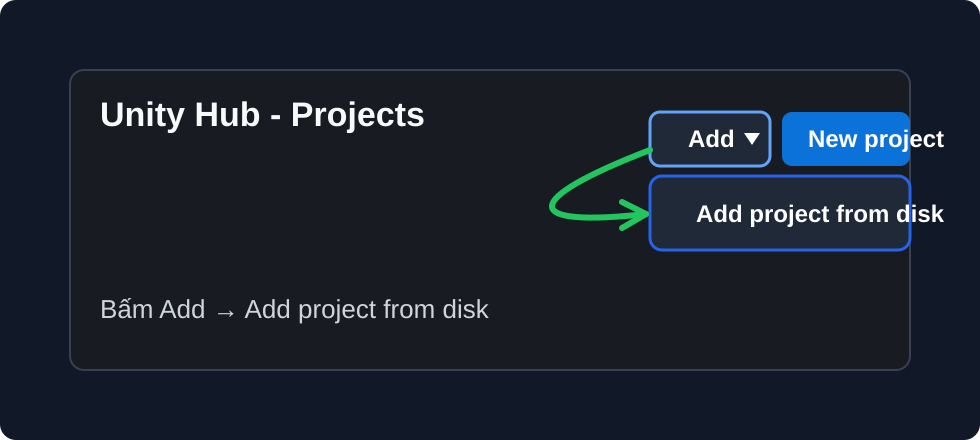
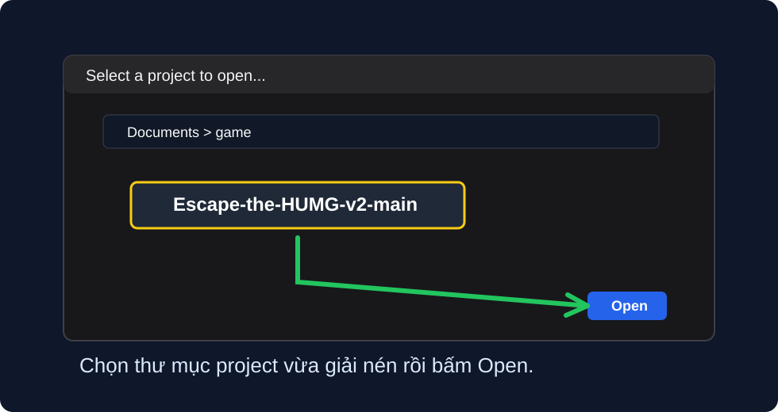
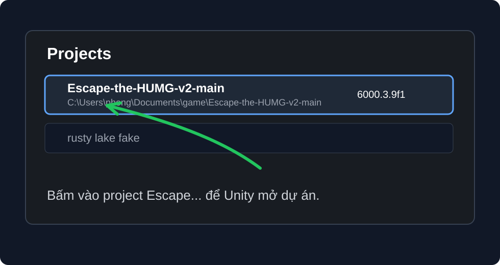
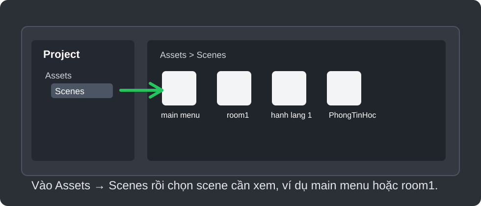

# Escape The HUMG

## 1. Hướng dẫn tải dự án về máy

Làm theo các bước sau:

1. Mở link dự án trên GitHub:

```text
https://github.com/phongnk123nk/Escape-the-HUMG-v2
```

2. Bấm nút **Code** màu xanh.

3. Chọn **Download ZIP**.

4. Chờ file ZIP tải xong.

5. Giải nén file ZIP ra một thư mục dễ tìm trên máy, ví dụ:

```text
D:\UnityProjects\Escape-the-HUMG-v2
```

6. Sau khi giải nén, mở thư mục đó ra và kiểm tra có các thư mục sau:

```text
Assets
Packages
ProjectSettings
```

Nếu có đủ 3 thư mục trên thì đã tải đúng dự án Unity.

Không mở trực tiếp project trong file ZIP. Phải giải nén ra trước.

## 2. Hướng dẫn tải Unity Hub

Unity Hub là phần mềm dùng để cài Unity và mở project Unity.

Làm theo các bước sau:

1. Mở trang tải Unity:

```text
https://unity.com/download
```

2. Bấm **Download for Windows** hoặc **Download Unity Hub**.

3. Chờ file cài đặt tải xong.

4. Mở file vừa tải về và cài Unity Hub.

5. Cài xong thì mở **Unity Hub**.

Nếu Unity yêu cầu đăng nhập, hãy đăng nhập bằng tài khoản Unity hoặc tạo tài khoản miễn phí.

## 3. Add project vào Unity Hub và mở project

Sau khi đã có Unity Hub, tiến hành thêm project vừa tải về vào Unity Hub.

### Hình 1: Bấm Add và chọn Add project from disk



Trong Unity Hub:

1. Vào tab **Projects**.
2. Bấm nút **Add**.
3. Chọn **Add project from disk**.

### Hình 2: Chọn thư mục vừa giải nén



Ở cửa sổ chọn thư mục:

1. Tìm đến nơi đã giải nén project.
2. Chọn thư mục có tên gần giống:

```text
Escape-the-HUMG-v2-main
```

3. Bấm **Open**.

Lưu ý: chọn thư mục project, không chọn riêng thư mục `Assets`.

### Hình 3: Chọn project Escape... để mở



Sau khi add xong, Unity Hub sẽ hiện project trong danh sách.

1. Tìm project có tên bắt đầu bằng **Escape-the-HUMG...**.
2. Kiểm tra cột **Editor version** là Unity `6000.3.9f1` hoặc gần đúng bản đó.
3. Bấm vào tên project để mở.

Lần đầu mở sẽ hơi lâu vì Unity phải import lại toàn bộ asset.

### Hình 4: Vào Assets > Scenes và chọn scene cần xem



Sau khi Unity mở project:

1. Nhìn xuống cửa sổ **Project** ở phía dưới.
2. Vào thư mục:

```text
Assets
```

3. Mở tiếp thư mục:

```text
Scenes
```

4. Chọn scene muốn xem hoặc muốn chạy.

Scene nên mở đầu tiên là:

```text
main menu.unity
```

Sau khi mở scene, bấm nút **Play** ở phía trên Unity để chạy game.
